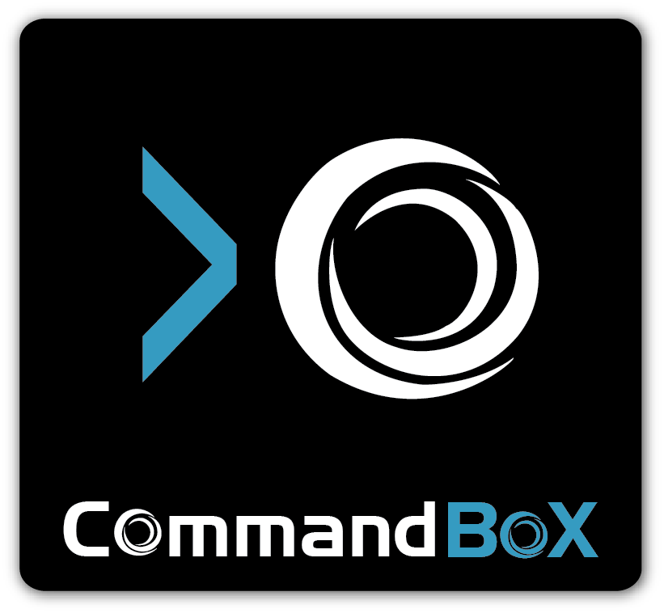

# ContentBox Manual - Version 1.0.0


CommandBox is a standalone, native tool for Windows, Mac, and Linux that will provide you with a Command Line Interface (CLI) for developer productivity, tool interaction, package management, embedded CFML server, application scaffolding, and some sweet ASCII art. It seamlessly integrate to work with any of [Ortus Solutions](http://www.ortussolutions.com/products) *Box products but it is also open for extensibility for any ColdFusion (CFML) project as it is also written in ColdFusion (CFML) using our concepts of CommandBox Commands.


# Versioning
CommandBox is maintained under the [Semantic Versioning](http://semver.org) guidelines as much as possible.Releases will be numbered with the following format:

```
<major>.<minor>.<patch>
```

And constructed with the following guidelines:

* Breaking backward compatibility bumps the major (and resets the minor and patch)
* New additions without breaking backward compatibility bumps the minor (and resets the patch)
* Bug fixes and misc changes bumps the patch


# License
CommandBox is open source and bound to the [LGPL v3 GNU LESSER GENERAL PUBLIC LICENSE](https://www.gnu.org/licenses/lgpl.html)

* Copyright by Ortus Solutions, Corp
* CommandBox is a registered trademark by Ortus Solutions, Corp


>**Info** The CommandBox Websites, Documentation, logo and content have a separate license and they are a separate entity.

# Discussion & Help
The CommandBox help and discussion group can be found here: https://groups.google.com/a/ortussolutions.com/forum/#!forum/commandbox

# Reporting a Bug
We all make mistakes from time to time :) So why not let us know about it and help us out.  We also love pull requests, so please star us and fork us: https://github.com/ortus-solutions/commandbox
* By Jira: https://ortussolutions.atlassian.net/browse/COMMANDBOX


# Professional Open Source


CommandBox is a professional open source software backed by [Ortus Solutions, Corp](http://www.ortussolutions.com/services) offering services like:
* Custom Development
* Professional Support & Mentoring
* Training
* Server Tuning
* Security Hardening
* Code Reviews
* [Much More](http://www.ortussolutions.com/services)

# Resources
* Official Site: http://www.coldbox.org
* Source Code: https://github.com/coldbox/coldbox-platform
* Bug Tracker: https://ortussolutions.atlassian.net/browse/COLDBOX
* Twitter: [@coldbox](http://www.twitter.com/coldbox)
* Facebook: https://www.facebook.com/coldboxplatform
* Google+: https://www.google.com/+ColdboxOrg
* Vimeo Channel: http://vimeo.com/channels/coldbox
* ColdBox Wiki: http://wiki.coldbox.org


---

### HONOR GOES TO GOD ABOVE ALL
Because of His grace, this project exists. If you don't like this, then don't read it, its not for you.

<blockquote>
"Therefore being justified by **faith**, we have peace with God through our Lord Jesus Christ:
By whom also we have access by **faith** into this **grace** wherein we stand, and rejoice in hope of the glory of God." Romans 5:5
</blockquote>

---


