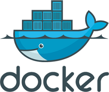

# Docker

## CommandBox Docker Deployments



CommandBox also provides an [official Docker image](https://hub.docker.com/r/ortussolutions/commandbox/), which allows you to leverage its capability to orchestrate live servers in multi-tier deployments.

Since CommandBox allows you to configure your entire CFML engine environment from a single file in the root of your project, packaging or mounting your CFML application in to a running CommandBox image container allows you to stand up your application in Docker containers in a matter of seconds.

## Usage

This section assumes you are using the [Official Docker Image](https://hub.docker.com/r/ortussolutions/commandbox/)

By default, the directory `/app` in the container is mapped as Commandbox home. To deploy a new application, first pull the image:

```
docker pull ortussolutions/commandbox
```

Then, from the root of your project, start with

```
docker run -p 8080:8080 -p 8443:8443 -v "/path/to/your/app:/app" ortussolutions/commandbox
```

By default the process ports of the container are 8080 (insecure) and 8443 (secure - if enabled in your `server.json`) so, once the container comes online, you may access your application via browser using the applicable port (which we explicitly exposed for external access in the `run` command above). You may also specify different port arguments in your `run` command to assign what is to be used in the container and exposed. This prevents conflicts with other instances in the Docker machine using those ports:

```
docker run -expose-list 80 443 -e "PORT=80" -e "SSL_PORT=443" -v "/path/to/your/app:/app" ortussolutions/commandbox
```

To create your own, customized Docker image, use [our Dockerfile repository](https://github.com/Ortus-Solutions/docker-commandbox) as the baseline to begin your customizations.

## Environment Variables

The CommandBox Docker image support the use of environmental variables for the configuration of your servers. Specifically, the image includes the [`cfconfig` CommandBox module](https://www.forgebox.io/view/commandbox-cfconfig), which allows you to provide custom settings for your engine, including the admin password.

* `$PORT` - The port which your server should start on. The default is `8080`.
* `$SSL_PORT` - If applicable, the ssl port used by your server The default is `8443`.
* `$CFENGINE` - Using the `server.json` syntax, allows you to specify the CFML engine for your container
* `$HEALTHCHECK_URI` - Specifies the URI endpoint for container health checks. By default, this is set `http://127.0.0.1:${PORT}/` at 1 minute intervals with 5 retries and a timeout of 30s
* `$cfconfig_[engine setting]` - Any environment variable provided which includes the `cfconfig_` prefix will be determined to be a `cfconfig` setting and the value after the prefix is presumed to be the setting name. The command `cfconfig set ${settingName}=${value}` will be run to populate your setting in to the `$SERVER_HOME_DIRECTORY`.
* `$cfconfigfile` - A `cfconfig`-compatible JSON file may be provided with this environment variable. The file will be loaded and applied to your server. If an `adminPassword` key exists, it will be applied as the Server and Web context passwords for Lucee engines
* `$SERVER_HOME_DIRECTORY` - When provided, a custom path to your server home directory will be assigned. By default, this path is set as `/root/serverHome` ( _Note: You may also provide this variable in your app's customized_ `server.json` _file_ )
