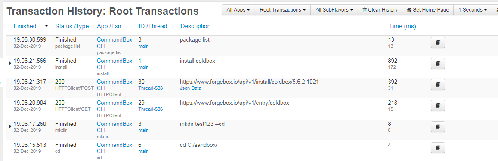
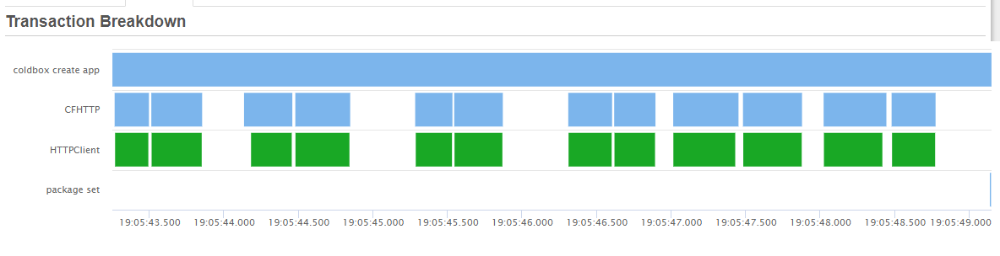

# FusionReactor for the CLI

If you are working on CommandBox custom commands or Task Runners and have a FusionReactor license, you can use that license to track what commands are running at the CLI, including HTTP requests and database calls.  This is super handy for debugging your code at the CLI.  CommandBox even reports its startup times to FusionReactor

In order to set this up, you'll need the fusionreactor.jar in a folder somewhere.  Note, you'll probably get errors if you try to start more than once instance of the shell while FR is enabled.  Also note this has nothing to do with using FR for a web server.  We have a module for that-- this is JUST for using FR from the CLI!

## JVM Args

How you set the JVM args for the actual CLI process differs based on your OS.  For Windows, we'll use a little feature of the Launch4J binary and create a file called `box.l4j.ini` placed in the same directory as the `box.exe` file.  Place one JVM arg on each line:

```
-javaagent:C:\\fusionreactor\\fusionreactor.jar=name=CommandBox-CLI,address=8088
-agentpath:C:\\fusionreactor\\frjvmti_x64.dll
-Dfrlicense=XXXXX-XXXXX-XXXXX-XXXXX-XXXXX
```

Any backslashes need to be escaped.  You can modify the port to your liking as well.  For Mac or Linux, you can pass extra JVM args into the CLI process by setting an environment variable in bash prior to running `box`.

```
BOX_JAVA_ARGS="-javaagent:/fusionreactor/fusionreactor.jar=name=CommandBox-CLI,address=8088"
export BOX_JAVA_ARGS
box
```

You can set the debugger lib and license the same in \*nix, I just omitted it above for brevity.&#x20;

## Web UI

When CommandBox first starts, you should see some extra output in the console from FusionReactor.  Now you can navigate to the port you set on localhost in a browser and se the **Transactions** menu.  Don't look under **Web Requests** as you won't find anything there.  You want **Transactions**!  Running commands will show up in the activity page and completed commands will show in the history.&#x20;

All of the standard FR functions you're used to including memory/CPU tracking JDBC requests, stack traces, the profiler and debugger are all available to you!  This works because FusionReactor has an API that CommandBox uses to report what it's doing automatically. &#x20;



You even get sweet trans breakdowns. Here is a `coldbox create app` command that runs several HTTP calls and a nested `package set` command.


