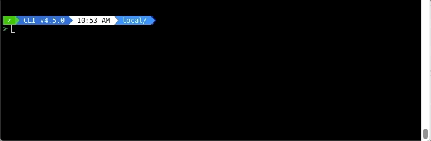

---
metaLinks:
  alternates:
    - >-
      https://app.gitbook.com/s/Bw6M3PI3e5HgLVcKZz0G/forgebox-enterprise/commands/login
---

# Login

The next step is to authenticate against your endpoint using valid credentials as is shown below:\
`forgebox login endpointName=stg-forgebox`


Enter your username and password and make sure you authenticate successfully.

