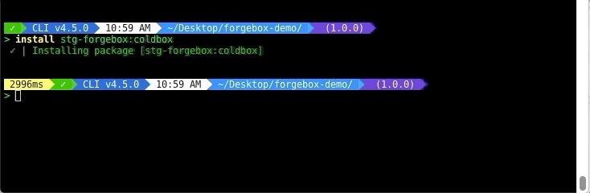

---
metaLinks:
  alternates:
    - >-
      https://app.gitbook.com/s/Bw6M3PI3e5HgLVcKZz0G/forgebox-enterprise/commands/remove
---

# Remove

You can remove endpoints anytime by using the remove command:\
`forgebox endpoint remove demo-endpoint`

