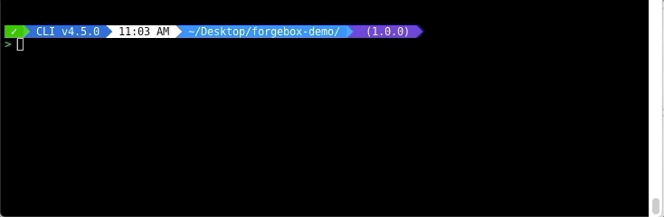

# Set Default

If you want to update your endpoint to be the default one, just do it like this:  
`forgebox endpoint set-default stg-forgebox`

This will default your endpoint and you will be able to install packages from your endpoint without giving a namespace.


You can verify that your default endpoint has changed by executing the list command.


