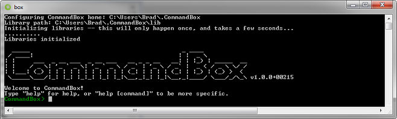
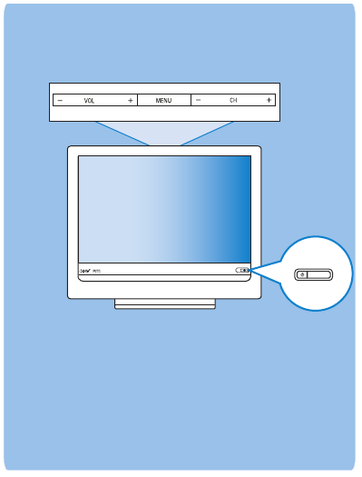
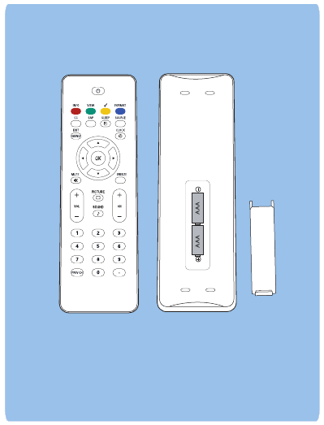
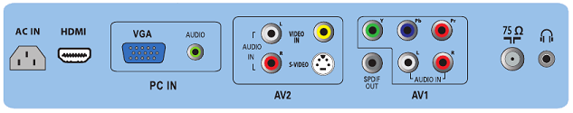

# CommandBox Getting Started Guide

Congratulations on your choice of CommandBox, the next generation of CFML productivity tooling!  We're pleased you've chosen this product and we can't wait to help you get started with it.  Setup is easy and painless.  We'll walk you through the steps you need to become the jealous rage of your peers with the class of a Java guru, the hipster appeal of a Rubyist, and the ASCII art fetish of a Node.js developer.

<center>
    
</center>
<br>

Your CommandBox download was quality checked and  shipped from our integration server with the following items.  You'll want to check the contents of the package to ensure you received everthing.
* CLI
* Package Manager
* Embedded CFML Server
* REPL
* Built-in Help
* ASCII Art

## 1. Download


If you don't already have CommandBox in hand, download it from the product page on the Ortus Solutions site:
* [http://www.ortussolutions.com/products/commandbox](http://www.ortussolutions.com/products/commandbox#download)
 
If you already have Java 1.7 or higher installed on your PC, choose the **No JRE Included** download for your operating system.  Otherwise, you can grab the **With JRE Included** for a single-download solution.

You're well on your way now.   While you wait for arrival you might want to secure any loose hair or shirt sleeves and clear a clean space to work on your desktop.  Safety first!


## 2. Unzip & First Run


Your CommandBox is sent to you via a zip archive.  Decompress the archive to a location of your choice.  The **No JRE Included** download will only have one file in it named `box`.  For Windows users, this will be an `exe` file.  For unix-based users, it will be an executable binary.The **With JRE Included** version will have a `jre` folder.  Keep that folder in the same location as the executable so it can be found.


Now just double click the file from your GUI, or execute it via a console window.  This will start a short, quick, one-time process of unpacking CommandBox into your user's home directory.  Congratulations, CommandBox is now installed!  You'll still run the same eecutable binary everytime you want to use the CLI, but the extraction process won't need to happen again.



The green `CommandBox>` prompt is what we call the *interactive shell*.  Type `exit` to close the window or be returned to your OS's native shell.  

## 3. Setup & Usage


To open up the interactive shell at any time, just double click on the `box` executable.  If you prefer to stay in your OS's native shell, then just place the `box` file in your system path and add it before any CommandBox commands like so:

```bash
C:\ > box version
CommandBox 1.0.0+00215
C:\ > _ 
```

The rest of this guide, however, will assume you're sitting at the interactive shell, where you can enjoy cross-platform command consistency, custom history, and tab completion.

The first command you'll want to try out is `help`.  Type it after a command, or even a partial command to help context-specific assistance.Check out the help for the `version` command and then run it to see what you get.

```bash
CommandBox> version help
```

Now, let's see if your installation is up to date with the `upgrade` command:

```bash
CommandBox> upgrade
```

Looking good.  Let's try a bit of CFML code from the REPL, shall we?  Type the `repl` command to be dropped into the REPL prompt.

```bash
CommandBox> repl
Enter any valid CFML code in the following prompt in order to evaluate it and print out any results (if any)
Type 'quit' or 'q' to exit!
CFSCRIPT-REPL: _
```

Type these lines one at a time and press enter to see what you get.
```
fruits = [ 'apples', 'oranges' ]
fruits.append( 'bananas' )

( fruits.len() ? 'Start eating!' : 'Time to run to the store' )

for( fruit in fruits ) {
  echo( fruit & chr(10) )
}
```

When you're done, just type `quit` to exit the REPL.  How does it feel to master CFML from the command line?

### Package Manager


It's about time we did something useful.  CommandBox allows you to *install* stuff and it makes it really easy.  You now have ForgeBox on speed dial.   Let's create a little playground to experiment in.  Adjust this accordingly for Unix-based OS's.

```bash
CommandBox> mkdir C:\playground
CommandBox> cd C:\playground
```

I wonder how many projects Luis Majano has posted on ForgeBox.  We can look with the `forgebox search` command:  Hint, try pressing `tab` while typing a command for auto-completion.

```bash
CommandBox> forgebox search Luis

```

Wow, that Luis guy is busy!  Let's install the the ColdBox MVC Platform.  Don't worry, this won't hurt a bit!

```bash
CommandBox> install coldbox
```

We can create a skeleton ColdBox app really easy with the ColdBox generator commands.  Let's give them a try:

```bash
CommandBox> coldbox create app MyApp
```

### Embedded Server


Now that we have a nifty little test app, let's give it a spin.  Wait, you don't need to install a CF server, CommandBox has one built in!  You can start up an ad-hoc server in *any* folder on your hard drive simply by typing `start`.  It really couldn't be any simpler.

```bash
CommandBox> start
```

In a few seconds, a browser window will appear with your running application.  This is a full server with access to the web administrator where you can add data sources, mappings, or adjust the server settings.  Notice the handy icon added to your system tray as well.  You can even edit the files in your new site from the command line:


```bash
CommandBox> edit views/main/index.cfm
```

When you're done playing, just shutdown your server with the `stop` command.  It will save all of its settings for the next time you start it.  Feel free to delete the playground directory at any time.  It won't break a thing.

```bash
CommandBox> stop
```

### Next Steps


Your well on your way to becoming a more productive you.  Experiment with CommandBox to see what else you can do with it.  This rest of this documentation book is a good place to start.  Also, we have full documentation of every command in our [Command API Docs.](http://apidocs.ortussolutions.com/commandbox/current).  

If you run in issues or just have questions, please jump on our [CommandBox Google Group](https://groups.google.com/a/ortussolutions.com/forum/#!forum/commandbox) and ask away.

CommandBox is [Professional Open Source](https://github.com/Ortus-Solutions/commandbox) under the LGPL license.  We'd love to have your help with the product.  Commands are actually implemented in CFML which means you can write your own and share them on ForgeBox.   See if you can figure out how to find and install the "Church Norris" command.  Also, the `snake` game is a good way to cure boredom.  These should give you some ideas of how you can contribute.


