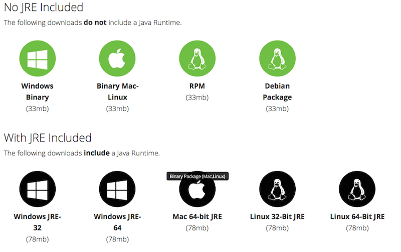

# Download

If you already have a Java JRE installed level 1.7 or higher (and set in
your environment variables) you can [download](http://www.ortussolutions.com/products/commandbox#download) the non-JRE version for
your Operating System. If you don't have a JRE installed or aren't sure, we would recommend you [download](http://www.ortussolutions.com/products/commandbox#download) the version with a JRE included.  Below you will find the way to get the latest stable and bleeding edge releases.  Please also note that in our [installation](installation.md) page you will find much more detail information on how to install CommandBox with modern Operating System package managers as well.


>**Info** The non-JRE versions are all around 33MB in size, while the embedded JRE versions will go up to 80MB in size.

<br>
Below you can see an image of the available downloads from the Ortus Solutions [download](http://www.ortussolutions.com/products/commandbox#download) page:



</div>

## Stable Release

Stable versions of CommandBox can be downloaded from the downloads
section of our product page.
http://www.ortussolutions.com/products/commandbox#download


## Bleeding Edge

We use a Jenkins integration server to automate our builds. You can
download a bleeding-edge version of CommandBox directly from our
integration server here:
http://integration.stg.ortussolutions.com/artifacts/ortussolutions/commandbox/

>**Info** Keep in mind, bleeding edge builds may contain experimental features
that are likely to change or bugs.

## Auto Updates

Another way to get the bleeding edge version of CommandBox is to install
the stable version and run our `upgrade` command using the
**latest** flag. [Upgrade API docs](http://apidocs.ortussolutions.com/commandbox/current/index.html?commandbox/system/commands/upgrade.html).

```bash
upgrade --latest
```

>**Info** Please note that the upgrade command will not update the main CommandBox binary. If there are major updates or you get a message about updating the binary, you will need to download the latest binary and re-install it.
