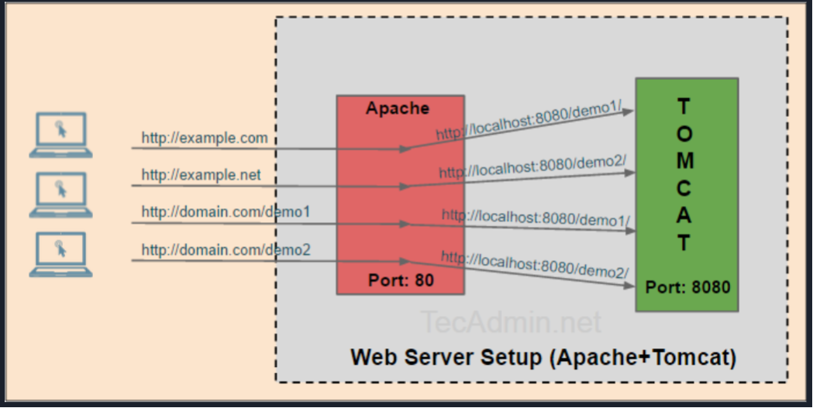

# Bullet Train Prompt

This module will customize your CommandBox prompt while in the interactive shell. It has multiple "cars" that are part of the train and each car can contribute some output to the prompt that is working directory-aware.

**THIS MODULE REQUIRES COMMANDBOX 4.0.0!**

This project is based on the Zsh Bullet Train theme which is based on the Powerline shell prompt. The goal is to add in additional information to your prompt that is specific to the current working directory, or the last command you ran.



## Installation

Install the module like so:

```text
install commandbox-bullet-train
```

## Fonts

This module uses some special Unicode characters to draw the prompt that may not be in your default terminal. You can turn off all Uniode chars and live with an uglier shell like so:

```text
config set modules.commandbox-bullet-train.unicode=false
```

Or try a font like `Consolas`, `DejaVu Sans Mono`, or `Fira Code`. The best way to get all the characters to work is to install a "Powerline patched" font and set your terminal to use it. This may differ based on your operating system.

[https://github.com/powerline/fonts.git](https://github.com/powerline/fonts.git)

Here is a guide for setting a new font up to be used with the Windows cmd terminal:

[https://www.techrepublic.com/blog/windows-and-office/quick-tip-add-fonts-to-the-command-prompt/](https://www.techrepublic.com/blog/windows-and-office/quick-tip-add-fonts-to-the-command-prompt/)

For Windows users, we also recommend using ConEMU as your terminal.

## Usage

You don't need to do anything special. Just continue to use the CommandBox interactive shell like you always do.  
You'll notice that the prompt is spanned across two lines and contains additional information.  
Cars that do not apply to the current directory will simply not be displayed. Familiarize yourself with what each bullet train "car" represents and soon you'll be using the data in the prompt without even thinking about it!

## Customize it!

You can customize the cars that show, change the colors of existing cars and even create your own custom additions to Bullet Train.  Read all about it in the readme of the Module homepage on ForgeBox.




