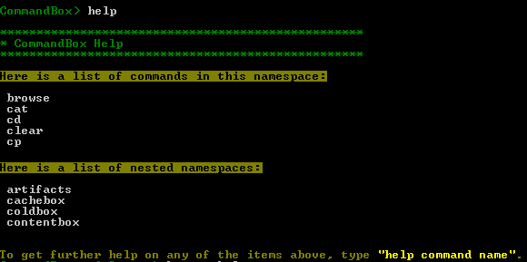
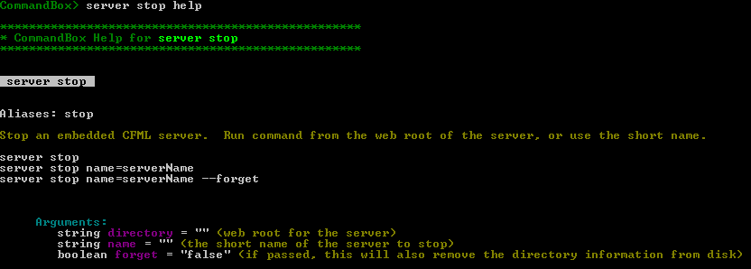

# Command Help

Help is integrated at every level in CommandBox. You can help global help, namespace help, or command help at any time.

## Global Help

To get an overall list of all the commands you have available to run, simply type `help` at the shell.



## Namespace Help

Next, drill down and get help on a specific namespace like `server`.


## Command Help

And finally, get help on a single command such as `server stop`. We can see the command is also aliased as just `stop` as well as all the possible parameters and their types along with a few sample ways to call the command.



## HTML Command API Docs

For a full list of all the commands that ship with CommandBox as well as all their paramaters and samples, please visit our [Command API docs](http://apidocs.ortussolutions.com/commandbox/current) which are auto-generated each build. This is the same information available to you via the `help` command, but in a searchable format you can browse outside of the CLI.

* [http://apidocs.ortussolutions.com/commandbox/current](http://apidocs.ortussolutions.com/commandbox/current)

## System Logs

Sometimes, you need to view the CommandBox log file. Maybe it is to debug a command you are writing or to [submit a crash report](https://ortussolutions.atlassian.net/secure/RapidBoard.jspa?rapidView=24&projectKey=COMMANDBOX). The `system-log` command outputs the path to the CommandBox log file. You can use it creatively by piping its output in to other commands:

```bash
CommandBox> system-log | open
CommandBox> system-log | cat
CommandBox> system-log | tail
```

